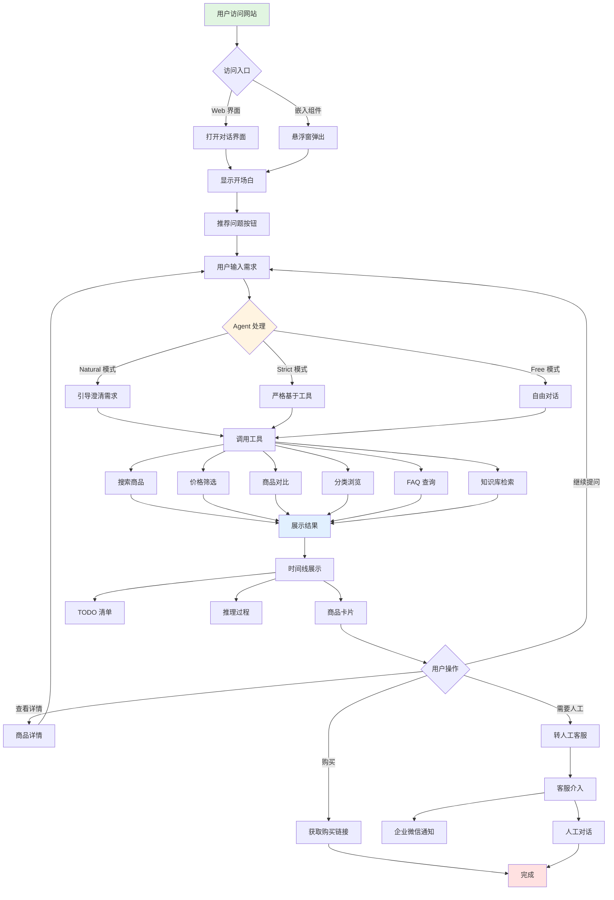
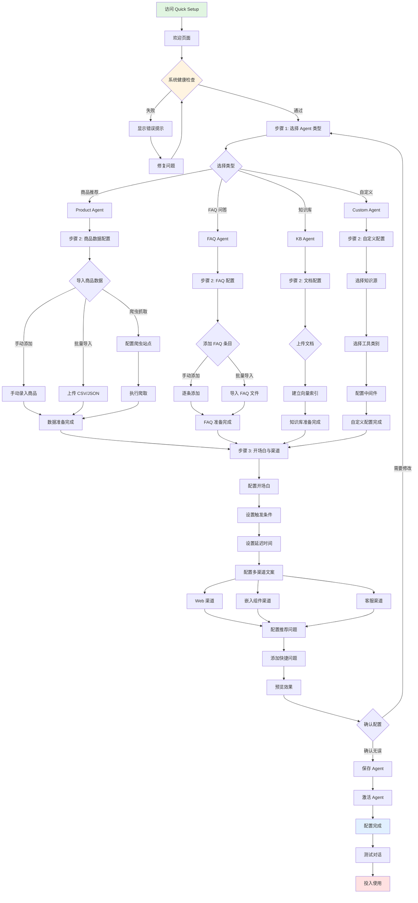

# 🤖 EmbedAI Agent - 智能商品推荐助手

<div align="center">


**一款开箱即用的 AI 智能客服系统，帮助用户快速找到心仪商品**

[](https://www.docker.com/)
[](https://www.python.org/)
[](https://nextjs.org/)
[](https://langchain.com/)

</div>

---

## � 这是什么？

**EmbedAI Agent** 是一个**智能商品推荐系统**，就像你网站上的"金牌客服"：

- 🛒 **用户说需求，AI 帮你找商品** — 输入"3000 元以内的轻薄本"，立刻推荐匹配商品
- 💬 **像真人一样对话** — 会追问、会对比、会记住你的喜好
- 🔌 **一行代码嵌入你的网站** — 任何网站都能用的悬浮客服窗口
- 🚀 **3 分钟部署上线** — 不懂代码也能用

---

## 🎯 我能用它做什么？

### 👤 如果你是普通用户

| 场景 | 效果 |
|------|------|
| 🔍 **找商品** | 告诉 AI "我想买降噪耳机"，它会帮你搜索并推荐 |
| 💰 **按预算筛选** | "2000 元以下的有哪些？"，自动过滤价格 |
| ⚖️ **对比选择** | "索尼和苹果耳机哪个好？"，给你详细对比 |
| 📝 **记住偏好** | 下次再来，它还记得你喜欢什么品牌 |

### 👨‍💼 如果你是网站运营者

| 功能 | 说明 |
|------|------|
| 🎨 **可嵌入小组件** | 一行代码添加到你的网站，右下角弹出客服窗口 |
| 🔧 **管理后台** | 查看对话记录、管理商品、配置 Agent |
| 👨‍💻 **人工客服接入** | AI 处理不了时，自动通知人工客服介入 |
| 📊 **数据分析** | 所有对话、工具调用都有记录 |

### 👨‍💻 如果你是开发者

| 能力 | 详情 |
|------|------|
| 🔀 **多 LLM 支持** | 一键切换 OpenAI / DeepSeek / SiliconFlow 等 |
| 🧠 **完整记忆系统** | 用户画像 + 事实记忆 + 知识图谱 |
| 🛠️ **可扩展工具链** | 轻松添加自定义工具 |
| 📡 **实时流式输出** | SSE + WebSocket，所见即所得 |

---

## 🏗️ 系统架构

```
                                    ┌─────────────────────────────────────┐
                                    │           LLM 服务商                 │
                                    │  ┌─────────┐ ┌─────────┐ ┌────────┐ │
                                    │  │ OpenAI  │ │DeepSeek │ │Silicon │ │
                                    │  │  GPT-4  │ │  Chat   │ │ Flow   │ │
                                    │  └────┬────┘ └────┬────┘ └───┬────┘ │
                                    └───────┼──────────┼──────────┼──────┘
                                            └──────────┼──────────┘
                                                       ▼
┌──────────────────┐              ┌─────────────────────────────────────────┐
│                  │   SSE/REST   │              后端服务                    │
│   用户浏览器      │◄────────────►│  ┌─────────────────────────────────┐    │
│                  │              │  │         FastAPI + LangGraph      │    │
│  ┌────────────┐  │              │  │  ┌───────────┐ ┌──────────────┐ │    │
│  │  对话界面   │  │              │  │  │Agent 核心 │ │  中间件矩阵   │ │    │
│  │  商品卡片   │  │   WebSocket  │  │  │ 推理/工具 │ │ 压缩/重试/TODO│ │    │
│  │  时间线     │  │◄────────────►│  │  └───────────┘ └──────────────┘ │    │
│  └────────────┘  │              │  └─────────────────────────────────┘    │
│                  │              │                    │                     │
│  ┌────────────┐  │              │  ┌─────────────────┴─────────────────┐  │
│  │  管理后台   │  │              │  │            数据存储层              │  │
│  │  客服面板   │  │              │  │  ┌─────────┐ ┌─────────┐ ┌─────┐ │  │
│  └────────────┘  │              │  │  │ SQLite  │ │ Qdrant  │ │MinIO│ │  │
└──────────────────┘              │  │  │ 对话/用户│ │ 向量检索 │ │图片 │ │  │
                                  │  │  └─────────┘ └─────────┘ └─────┘ │  │
        ┌──────────────┐          │  └─────────────────────────────────┘  │
        │  任意外部网站  │          └─────────────────────────────────────────┘
        │  ┌────────┐  │
        │  │嵌入组件 │  │◄─── 一行代码嵌入
        │  │(悬浮窗) │  │
        │  └────────┘  │
        └──────────────┘
```

---

## 📊 功能流程图

### 👤 用户侧完整流程



### 🔧 管理侧完整流程

```mermaid
graph TD
    Admin[管理员登录] --> Dashboard[管理后台首页]
    
    Dashboard --> QuickSetup{一站式引导}
    Dashboard --> AgentMgmt{Agent 管理}
    Dashboard --> DataMgmt{数据管理}
    Dashboard --> SupportMgmt{客服管理}
    Dashboard --> SystemMgmt{系统管理}
    
    QuickSetup --> QS1[选择 Agent 类型]
    QS1 --> QS2[配置知识源]
    QS2 --> QS3[设置开场白]
    QS3 --> QSComplete[Agent 创建完成]
    
    AgentMgmt --> ListAgent[Agent 列表]
    ListAgent --> CreateAgent[创建 Agent]
    ListAgent --> EditAgent[编辑 Agent]
    ListAgent --> ActivateAgent[激活 Agent]
    
    EditAgent --> ConfigPrompt[配置提示词]
    EditAgent --> ConfigTools[选择工具类别]
    EditAgent --> ConfigMiddleware[中间件开关]
    EditAgent --> ConfigMode[对话模式]
    EditAgent --> ConfigMemory[记忆配置]
    EditAgent --> ConfigGreeting[开场白设置]
    EditAgent --> ConfigQuestions[推荐问题]
    
    DataMgmt --> ProductMgmt[商品管理]
    DataMgmt --> FAQMgmt[FAQ 管理]
    DataMgmt --> KBMgmt[知识库管理]
    DataMgmt --> CrawlerMgmt[爬虫管理]
    
    ProductMgmt --> AddProduct[添加商品]
    ProductMgmt --> ImportProduct[批量导入]
    ProductMgmt --> EditProduct[编辑商品]
    
    FAQMgmt --> AddFAQ[添加 FAQ]
    FAQMgmt --> FAQStats[统计分析]
    FAQMgmt --> FAQMerge[智能合并]
    
    CrawlerMgmt --> AddSite[添加站点]
    CrawlerMgmt --> ConfigCrawler[配置爬虫]
    CrawlerMgmt --> RunCrawler[执行爬取]
    CrawlerMgmt --> ViewLogs[查看日志]
    
    SupportMgmt --> ConvList[会话列表]
    SupportMgmt --> NotifyConfig[通知配置]
    SupportMgmt --> OnlineStatus[在线状态管理]
    
    ConvList --> HeatSort[热度排序]
    ConvList --> FilterConv[筛选会话]
    ConvList --> ViewConv[查看对话]
    
    ViewConv --> TakeOver[接管会话]
    ViewConv --> EditMsg[编辑消息]
    ViewConv --> RecallMsg[撤回消息]
    ViewConv --> Regenerate[重新生成]
    
    TakeOver --> ManualTakeOver{接管方式}
    ManualTakeOver -->|手动接管| ClickTakeOver[点击接管按钮]
    ManualTakeOver -->|自动接管| AutoHandoff[触发自动转接]
    
    ClickTakeOver --> SendNotify[发送通知]
    AutoHandoff --> SendNotify
    
    SendNotify --> WechatNotify[企业微信通知]
    SendNotify --> WebhookNotify[Webhook 通知]
    SendNotify --> WSBroadcast[WebSocket 广播]
    
    WSBroadcast --> UpdateUserUI[更新用户界面]
    WSBroadcast --> UpdateSupportUI[更新客服界面]
    
    UpdateUserUI --> ShowHandoffMsg[显示转接提示]
    UpdateSupportUI --> ShowNewConv[显示新会话]
    
    ShowNewConv --> SupportReply[客服回复消息]
    SupportReply --> WSPush[WebSocket 推送]
    
    WSPush --> UserReceive[用户接收消息]
    WSPush --> UpdateMsgStatus[更新消息状态]
    
    UpdateMsgStatus --> DeliveredStatus[送达状态]
    UpdateMsgStatus --> ReadStatus[已读状态]
    
    NotifyConfig --> ConfigWechat[配置企业微信]
    NotifyConfig --> ConfigWebhook[配置 Webhook]
    NotifyConfig --> ConfigAutoHandoff[配置自动转接规则]
    
    ConfigAutoHandoff --> SetKeywords[设置关键词触发]
    ConfigAutoHandoff --> SetTimeout[设置超时转接]
    ConfigAutoHandoff --> SetSentiment[设置情绪检测]
    
    OnlineStatus --> SetOnline[设置在线]
    OnlineStatus --> SetOffline[设置离线]
    OnlineStatus --> SetBusy[设置忙碌]
    
    SetOnline --> ReceiveNotify[接收新会话通知]
    SetOffline --> PauseNotify[暂停通知]
    SetBusy --> LimitNotify[限制通知数量]
    
    SystemMgmt --> Settings[系统设置]
    SystemMgmt --> Health[健康检查]
    SystemMgmt --> Logs[日志查看]
    
    Settings --> LLMConfig[LLM 配置]
    Settings --> DBConfig[数据库配置]
    Settings --> MiddlewareConfig[中间件配置]
    
    Health --> CheckQdrant[Qdrant 状态]
    Health --> CheckDB[数据库状态]
    Health --> CheckLLM[LLM API 状态]
    
    style Admin fill:#e1f5e1
    style QSComplete fill:#e1f0ff
    style QuickSetup fill:#fff4e1
```



### 🎯 一站式引导详细流程



---

## ✨ 核心功能一览

### 🤖 四种 Agent 类型（按需选择）

系统支持四种不同类型的 Agent，每种都针对特定场景优化：

#### 1️⃣ 商品推荐助手（Product Agent）

**适用场景**：电商网站、商品导购、购物咨询

**核心能力**：
- 🔍 **智能搜索** - 理解自然语言需求，精准匹配商品
- 💰 **预算筛选** - 按价格区间自动过滤
- 📊 **商品对比** - 横向对比多款商品的参数和优劣
- 🏷️ **分类浏览** - 按品类、品牌、用途探索商品
- ⭐ **精选推荐** - 推荐热门、高评分商品
- 🔗 **相似推荐** - 找到类似款式或功能的替代品
- 🛒 **购买引导** - 提供购买链接和下单指引

**典型对话**：
- "帮我找 3000 元以内适合跑步的耳机" → 推荐运动耳机列表
- "索尼和 Bose 降噪耳机哪个好？" → 详细对比表格
- "这款有什么颜色？" → 查看商品详情和规格

#### 2️⃣ FAQ 问答助手（FAQ Agent）

**适用场景**：客服系统、售后支持、常见问题解答

**核心能力**：
- 📚 **FAQ 检索** - 从知识库快速找到最相关的答案
- 🎯 **精准匹配** - 理解问题意图，匹配最佳答案
- � **多轮澄清** - 问题不明确时主动追问
- 👨‍💼 **人工转接** - 无法回答时引导人工客服

**典型对话**：
- "如何退货？" → 返回退货政策和流程
- "发货需要多久？" → 查找物流相关 FAQ
- "会员有什么优惠？" → 展示会员权益说明

#### 3️⃣ 知识库助手（KB Agent）

**适用场景**：企业内部知识库、文档检索、技术支持

**核心能力**：
- 📖 **文档检索** - 从海量文档中找到相关内容
- 🔎 **语义搜索** - 理解查询意图，不局限于关键词
- � **引用来源** - 回答时标注文档出处
- 🎓 **知识整合** - 综合多个文档给出完整答案

**典型对话**：
- "如何配置 SSL 证书？" → 从技术文档中检索步骤
- "公司的报销流程是什么？" → 查找内部制度文档
- "这个 API 怎么调用？" → 返回 API 文档和示例

#### 4️⃣ 自定义助手（Custom Agent）

**适用场景**：特殊业务需求、混合场景、实验性功能

**核心能力**：
- 🛠️ **完全自定义** - 自由配置工具、中间件、知识源
- 🔀 **混合能力** - 可同时使用商品、FAQ、知识库功能
- 🎨 **灵活配置** - 按需启用记忆、TODO、上下文压缩等

**典型场景**：
- 同时支持商品推荐和售后咨询
- 结合内部知识库和外部 API
- 特定行业的定制化需求

**你可以自定义什么？**
- **知识源**：绑定任意已有的 KnowledgeConfig（商品库 / FAQ / 向量文档 / 混合源），实现跨业务回答。
- **工具能力**：在后台多选“搜索/查询/比较/筛选/FAQ 搜索/知识库搜索”等能力组合，决定助手会做哪些动作。
- **中间件策略**：独立控制 TODO 规划、上下文压缩、工具重试、工具调用上限、记忆系统等稳定性/体验开关。
- **对话模式**：为默认模式或特定渠道配置 Natural / Free / Strict，不同入口可以走不同策略。
- **提示词 & 开场白**：自带模板，可按业务编辑系统提示、欢迎语、推荐问题，甚至为 Web/嵌入组件定制不同文案。
- **渠道策略**：在 Quick Setup 或 Agent 管理中设置每个渠道的展示、按钮、唤起动作，嵌入组件和客服面板都能独立控制。

---

### 💬 三种对话模式（控制回答策略）

每个 Agent 都支持三种对话模式，适应不同的使用场景：

#### 🟢 Natural 模式（自然对话，默认）

**特点**：平衡体验和准确性，适合日常使用

**行为**：
- ✅ 优先使用工具搜索和查询
- ✅ 信息不足时主动追问
- ✅ 非相关话题温和引导回来
- ✅ 允许基于常识做简单回答

**适用场景**：
- 商品推荐（引导用户说明需求）
- 客服咨询（先理解问题再查询）
- 日常对话（自然流畅）

**示例**：
```
用户："有什么好的耳机推荐吗？"
Agent："好的！为了给您更精准的推荐，请问：
       1. 您的预算大概是多少？
       2. 主要用途是什么（通勤/运动/办公）？
       3. 对品牌有偏好吗？"
```

#### 🔵 Free 模式（自由聊天）

**特点**：可以聊任何话题，不强制回到业务

**行为**：
- ✅ 可以闲聊、回答常识问题
- ✅ 工具按需使用，不强制调用
- ✅ 不会强制引导回商品/业务话题
- ✅ 更像一个通用助手

**适用场景**：
- 社区论坛（用户可能闲聊）
- 品牌互动（建立情感连接）
- 多功能助手（不只是业务）

**示例**：
```
用户："今天天气真好"
Agent："是啊，这样的好天气很适合出去走走。
       如果您需要运动装备，我也可以帮您推荐哦～"
```

#### 🔴 Strict 模式（严格模式）

**特点**：必须有据可依，杜绝猜测和编造

**行为**：
- ✅ 必须基于工具查询结果回答
- ✅ 找不到信息时明确告知
- ✅ 不允许"我猜"、"可能"等模糊回答
- ✅ 信息不足时强制使用引导工具追问

**适用场景**：
- 医疗健康（不能给错误建议）
- 金融理财（必须准确）
- 法律咨询（需要依据）
- 高价值商品（避免误导）

**示例**：
```
用户："这款手机支持 5G 吗？"
Agent：[查询商品详情]
       "根据商品信息，这款手机支持 5G 网络，
       支持 n1/n3/n41/n78/n79 频段。"
       
用户："这个牌子好不好？"
Agent："抱歉，我需要更具体的信息才能回答。
       请问您想了解这个品牌的哪方面？
       （质量/售后/性价比/用户评价）"
```

**模式切换**：
- 可在管理后台为每个 Agent 设置默认模式
- 可在对话时动态切换模式
- 不同渠道（Web/小程序/嵌入组件）可使用不同模式

---

### 🧠 智能记忆系统

| 类型 | 功能 | 示例 |
|------|------|------|
| **👤 用户画像** | 记住用户的偏好和习惯 | 记住"喜欢苹果品牌"、"预算通常在 3000 左右" |
| **📝 事实记忆** | 存储对话中的关键事实 | 记住"上次看过索尼 XM5" |
| **🕸️ 知识图谱** | 建立实体之间的关联 | 关联"用户 → 喜欢 → 降噪耳机" |

### 🎯 一站式引导配置（Quick Setup）

**不懂技术？没关系！** 系统提供可视化向导，3 步完成 Agent 配置：

#### 步骤 1：选择 Agent 类型

访问管理后台 `http://localhost:3000/admin/quick-setup`，选择你需要的 Agent 类型：

- � **商品推荐助手** - 适合电商、导购场景
- � **FAQ 问答助手** - 适合客服、售后场景
- 📚 **知识库助手** - 适合企业内部知识管理
- 🛠️ **自定义助手** - 适合特殊需求

#### 步骤 2：配置知识源

根据选择的类型，系统会引导你配置对应的数据源：

| Agent 类型 | 需要配置 | 说明 |
|-----------|---------|------|
| 商品推荐 | 商品数据 | 导入商品或配置爬虫自动抓取 |
| FAQ 问答 | FAQ 条目 | 添加常见问题和答案 |
| 知识库 | 文档集合 | 上传文档并建立索引 |
| 自定义 | 自选 | 可混合使用多种数据源 |

#### 步骤 3：设置开场白和渠道

- **开场白**：设置首次访问时的欢迎语
- **渠道配置**：为不同渠道（Web/嵌入组件/小程序）定制消息
- **推荐问题**：配置快捷问题按钮，引导用户提问

**完成！** 配置完成后，Agent 立即可用，可以在对话界面测试效果。

---

### 🔧 后台管理系统

| 模块 | 功能 |
|------|------|
| **🎯 一站式引导** | 可视化向导，3 步完成 Agent 配置（推荐新手使用） |
| **🤖 Agent 管理** | 配置多个 Agent、设置提示词、选择对话模式 |
| **📦 商品管理** | 添加、编辑、删除商品，支持批量导入 |
| **📚 知识库管理** | 管理 FAQ 条目、上传文档、配置检索参数 |
| **💬 对话管理** | 查看所有对话记录、用户信息、消息统计 |
| **🕷️ 网站爬虫** | 自动从网站抓取商品信息（支持 SPA） |
| **👨‍💼 客服支持** | 人工客服介入、企业微信通知、SLA 监控 |

### 🔌 嵌入式组件

可以将 AI 助手嵌入到任何网站：

```html
<!-- 只需一行代码 -->
<script 
  src="https://your-cdn.com/embed-ai-chat.js"
  data-auto-init
  data-api-base-url="https://your-backend.com"
  data-title="商品推荐助手">
</script>
```

效果：网站右下角出现悬浮客服窗口，用户可以随时提问。

---

## 🚀 快速开始（3 分钟部署）

### 方式一：Docker 一键部署（推荐，零代码）

**你只需要：** 一台装了 Docker 的电脑 + 一个 LLM API Key

```bash
# 第 1 步：下载项目
git clone https://github.com/你的账号/embedAi-agent.git
cd embedAi-agent

# 第 2 步：运行安装向导
./install.sh
```

安装向导会一步步引导你：
1. ✅ 自动检查 Docker 环境
2. 📋 选择向量数据库（推荐内置 Qdrant）
3. 🤖 选择 LLM 提供商（推荐 SiliconFlow，国内快速便宜）
4. 🔑 输入你的 API Key
5. 🚀 自动启动所有服务

**完成后访问：**

| 地址 | 用途 |
|------|------|
| http://localhost:3000 | 💬 对话界面 |
| http://localhost:3000/admin/quick-setup | 🎯 一站式引导（推荐首次使用） |
| http://localhost:3000/admin | ⚙️ 管理后台 |
| http://localhost:8000/docs | 📄 API 文档 |

### 方式二：本地开发部署（适合开发者）

**前置条件：** Python 3.13 + Node.js 18+ + 本地 Qdrant

```bash
# 后端
cd backend
uv sync                           # 安装依赖
cp .env.example .env              # 配置文件，填入 API Key
uv run python scripts/import_products.py  # 导入示例数据
uv run uvicorn app.main:app --reload --port 8000

# 前端（新终端）
cd frontend
pnpm install
pnpm dev
```

---

## ⚙️ 配置说明

### 最重要的配置（必须填）

| 配置项 | 说明 | 示例值 |
|--------|------|--------|
| `LLM_PROVIDER` | LLM 服务商 | `siliconflow` / `openai` / `deepseek` |
| `LLM_API_KEY` | API 密钥 | `sk-xxxxx` |
| `LLM_BASE_URL` | API 地址 | `https://api.siliconflow.cn/v1` |
| `LLM_CHAT_MODEL` | 聊天模型 | `moonshotai/Kimi-K2-Thinking` |

### 可选配置

| 配置项 | 说明 | 默认值 |
|--------|------|--------|
| `CHAT_MODE` | 对话模式 | `natural` |
| `MEMORY_ENABLED` | 启用记忆系统 | `true` |
| `AGENT_TODO_ENABLED` | 启用 TODO 规划 | `true` |
| `CRAWLER_ENABLED` | 启用网站爬虫 | `false` |

> 📖 完整配置说明见 `backend/.env.example`，每个配置都有详细注释。

### 支持的 LLM 服务商

| 服务商 | 特点 | 推荐场景 |
|--------|------|---------|
| **SiliconFlow** | 国内访问快、价格便宜 | 🏆 国内用户首选 |
| **DeepSeek** | 性价比高、中文能力强 | 预算有限 |
| **OpenAI** | 效果最好 | 追求最佳效果 |
| **Anthropic** | Claude 系列 | 需要长上下文 |
| **其他** | 兼容 OpenAI API 格式的都行 | 自定义 |

---

## 📁 项目结构

```
embedAi-agent/
│
├── 📂 backend/                    # 后端服务
│   ├── 📂 app/
│   │   ├── 📂 core/               # 核心配置、LLM 抽象
│   │   ├── 📂 routers/            # API 路由
│   │   │   ├── chat.py            #   💬 聊天接口
│   │   │   ├── agents.py          #   🤖 Agent 管理
│   │   │   ├── crawler.py         #   🕷️ 爬虫管理
│   │   │   ├── support.py         #   👨‍💼 客服支持
│   │   │   └── ...
│   │   ├── 📂 services/
│   │   │   ├── 📂 agent/          #   Agent 核心逻辑
│   │   │   │   ├── 📂 tools/      #     🔧 工具链（12+ 个工具）
│   │   │   │   └── 📂 middleware/ #     ⚙️ 中间件
│   │   │   ├── 📂 memory/         #   🧠 记忆系统
│   │   │   ├── 📂 crawler/        #   🕷️ 网站爬虫
│   │   │   └── 📂 websocket/      #   📡 WebSocket
│   │   └── 📂 models/             # 数据模型
│   └── 📂 data/                   # 数据文件
│
├── 📂 frontend/                   # 前端服务
│   ├── 📂 app/
│   │   ├── 📂 admin/              # ⚙️ 管理后台
│   │   │   ├── 📂 agents/         #   Agent 管理
│   │   │   ├── 📂 products/       #   商品管理
│   │   │   ├── 📂 crawler/        #   爬虫管理
│   │   │   └── ...
│   │   └── 📂 support/            # 👨‍💼 客服界面
│   ├── 📂 components/
│   │   ├── 📂 features/chat/      # 💬 对话组件
│   │   └── 📂 ui/                 # 🎨 UI 组件
│   └── 📂 embed/                  # 🔌 嵌入式组件源码
│
├── 📂 docker/                     # Docker 配置
├── 📂 scripts/                    # 运维脚本
│   ├── backup.sh                  #   备份
│   ├── restore.sh                 #   恢复
│   └── update.sh                  #   更新
│
├── docker-compose.yml             # 开发环境
├── docker-compose.yml        # 生产环境
└── install.sh                     # 一键安装脚本
```

---

## 🛠️ 常用操作

### 日常运维

```bash
# 查看服务状态
docker compose -f docker-compose.yml ps

# 查看日志
docker compose -f docker-compose.yml logs -f

# 停止服务
docker compose -f docker-compose.yml down

# 重启服务
docker compose -f docker-compose.yml restart

# 备份数据
./scripts/backup.sh

# 更新应用
./scripts/update.sh
```

### 开发调试

```bash
# 后端开发
cd backend
uv run uvicorn app.main:app --reload --port 8000

# 前端开发
cd frontend
pnpm dev

# 导入商品数据
cd backend
uv run python scripts/import_products.py

# 代码检查
uv run ruff check .    # 后端
pnpm lint              # 前端
```

### 构建嵌入式组件

```bash
cd frontend
pnpm build:embed
# 产物在 dist/embed/embed-ai-chat.js
```

---

## 🔌 嵌入到你的网站

### 步骤 1：构建嵌入组件

```bash
cd frontend
pnpm build:embed
```

### 步骤 2：上传 JS 文件

将 `dist/embed/embed-ai-chat.js` 上传到你的 CDN 或静态服务器。

### 步骤 3：在网站中引入

```html
<!-- 自动初始化（推荐） -->
<script
  src="https://your-cdn.com/embed-ai-chat.js"
  data-auto-init
  data-api-base-url="https://your-backend.com"
  data-position="bottom-right"
  data-title="商品推荐助手"
  data-primary-color="#3B82F6">
</script>
```

或者手动控制：

```html
<script src="https://your-cdn.com/embed-ai-chat.js"></script>
<script>
  window.EmbedAiChat.init({
    apiBaseUrl: "https://your-backend.com",
    position: "bottom-right",
    title: "商品推荐助手",
    placeholder: "有什么可以帮您？"
  });
  
  // 需要时销毁
  // window.EmbedAiChat.destroy();
</script>
```

### 配置选项

| 参数 | 说明 | 默认值 |
|------|------|--------|
| `api-base-url` | 后端服务地址 | 必填 |
| `position` | 悬浮窗位置 | `bottom-right` |
| `title` | 窗口标题 | 商品推荐助手 |
| `placeholder` | 输入框提示 | 输入消息... |
| `primary-color` | 主题色 | #3B82F6 |

> ⚠️ **跨域提示**：确保后端 `.env` 中的 `CORS_ORIGINS` 包含你的网站域名。

---

## ❓ 常见问题

<details>
<summary><b>Q: API Key 从哪里获取？</b></summary>

根据你选择的 LLM 提供商：
- **SiliconFlow**: https://cloud.siliconflow.cn （推荐，国内访问快）
- **DeepSeek**: https://platform.deepseek.com
- **OpenAI**: https://platform.openai.com

</details>

<details>
<summary><b>Q: 如何添加自己的商品？</b></summary>

三种方式：
1. **管理后台**：访问 `/admin/products` 手动添加
2. **API 导入**：调用商品导入接口
3. **爬虫抓取**：配置站点后自动抓取

</details>

<details>
<summary><b>Q: 如何切换 LLM 提供商？</b></summary>

修改 `.env` 或 `.env.docker` 文件中的配置：
```bash
LLM_PROVIDER=openai
LLM_API_KEY=sk-xxx
LLM_BASE_URL=https://api.openai.com/v1
LLM_CHAT_MODEL=gpt-4
```
然后重启服务。

</details>

<details>
<summary><b>Q: 数据存在哪里？如何备份？</b></summary>

- **SQLite**：`data/` 目录下的 `.db` 文件
- **Qdrant**：Docker volume `qdrant_data`
- **备份命令**：`./scripts/backup.sh`

</details>

<details>
<summary><b>Q: 生产环境如何部署？</b></summary>

1. 修改 `.env.docker` 配置
2. 使用 `docker-compose.prod.yml`
3. 可选：切换到 PostgreSQL（`--profile postgres`）
4. 配置 Nginx 反向代理和 SSL

</details>

---

## 📞 获取帮助

- 📖 **详细文档**：查看各子目录的 README
- 📄 **API 文档**：访问 `http://localhost:8000/docs`
- 🐛 **报告问题**：提交 GitHub Issue

---

## 📄 许可证

本项目采用 MIT 许可证。

---

<div align="center">

**如果觉得有用，请给个 ⭐ Star 支持一下！**

</div>
