# 页面截屏

生成时间: 2026/1/29 16:23:57

| 页面 | 描述 | 截图 |
|------|------|------|
| / | 产品落地页 | 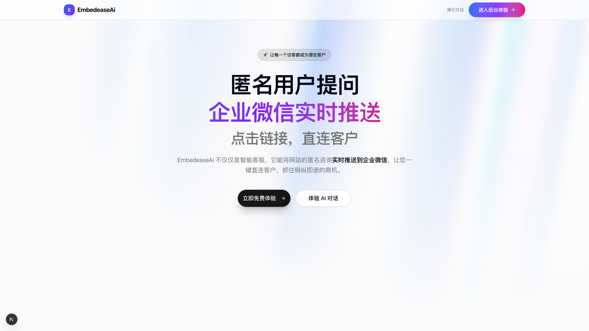 |
| /chat | 用户聊天界面 | 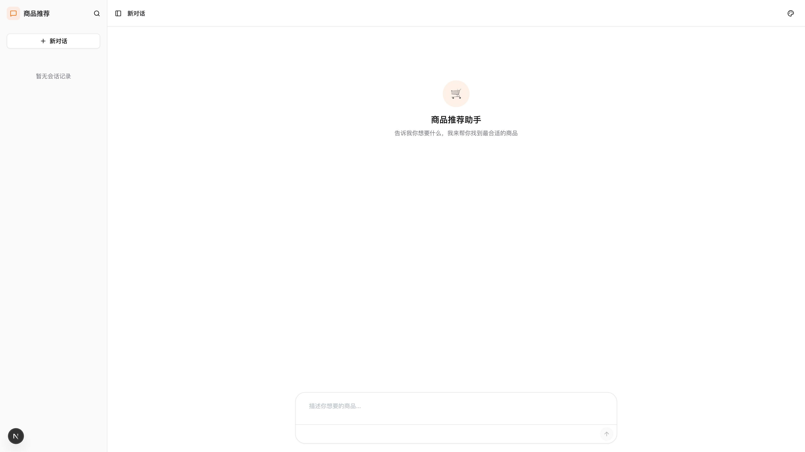 |
| /admin | 管理后台仪表盘 | 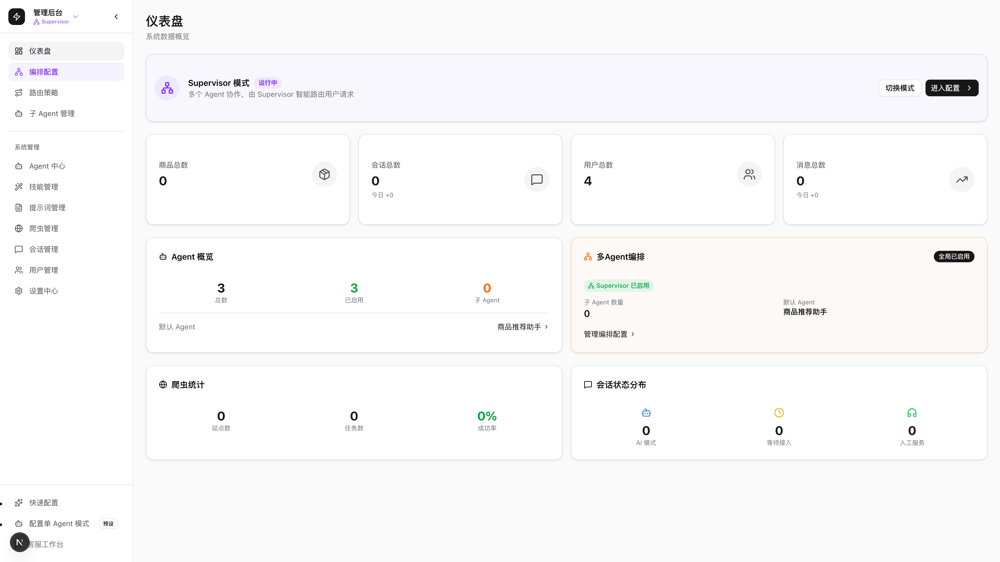 |
| /admin/quick-setup | 快速配置向导 | 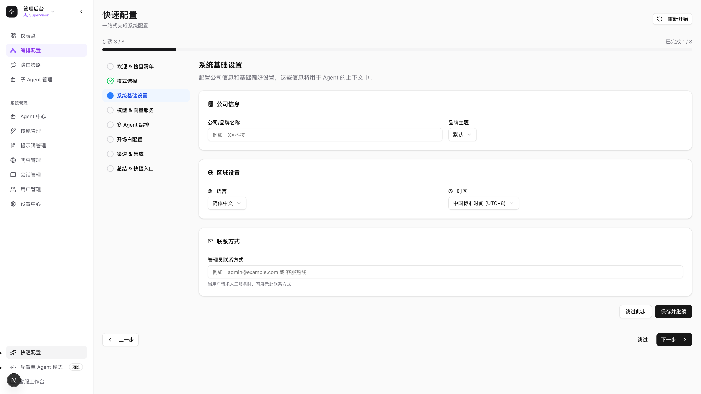 |
| /admin/agents | Agent 列表 | 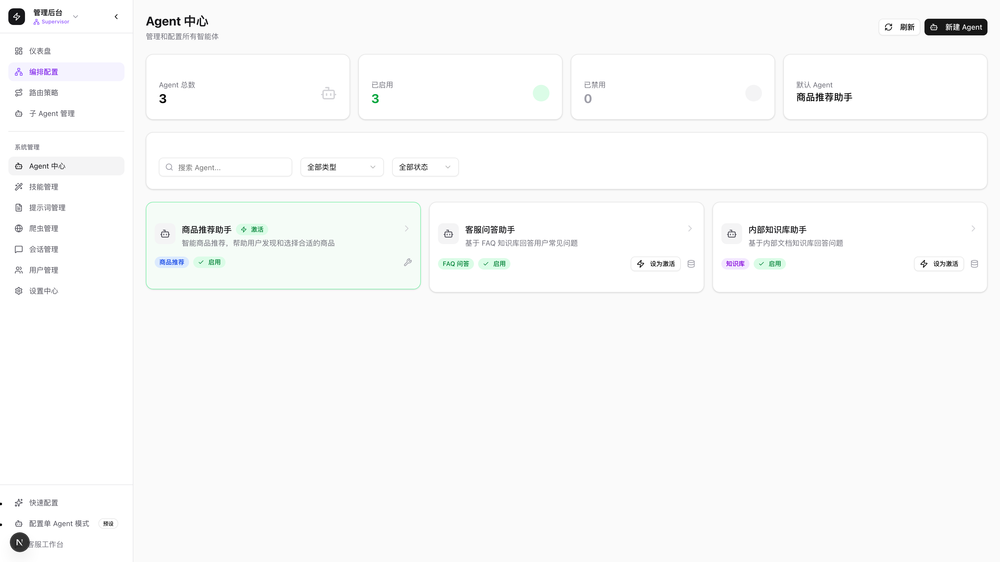 |
| /admin/single | 单 Agent 模式配置 | 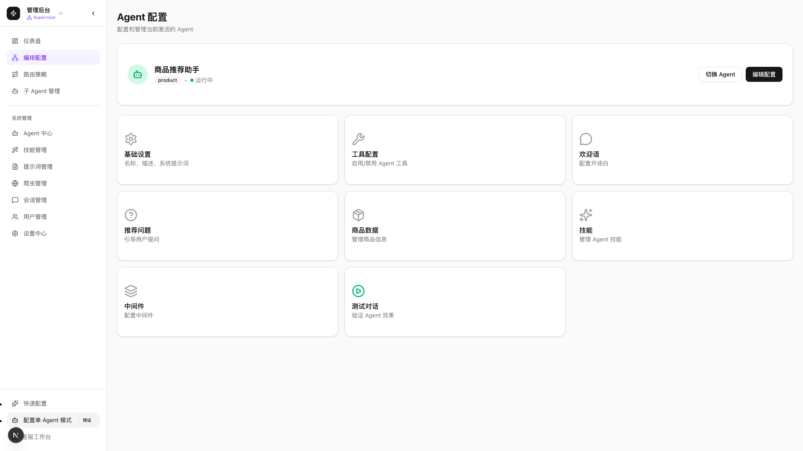 |
| /admin/multi | 编排模式配置 | 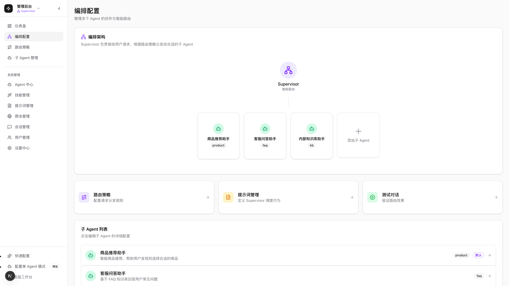 |
| /admin/settings | 系统设置 | 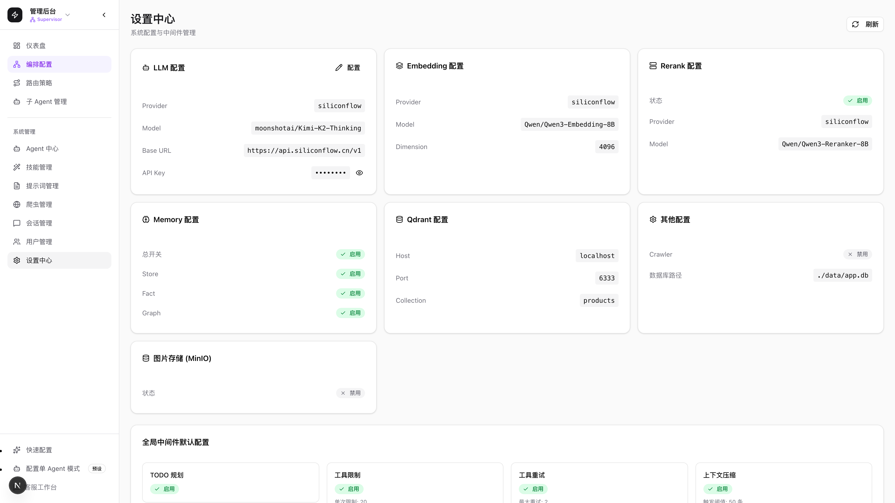 |
| /admin/settings/mode | 模式设置 | 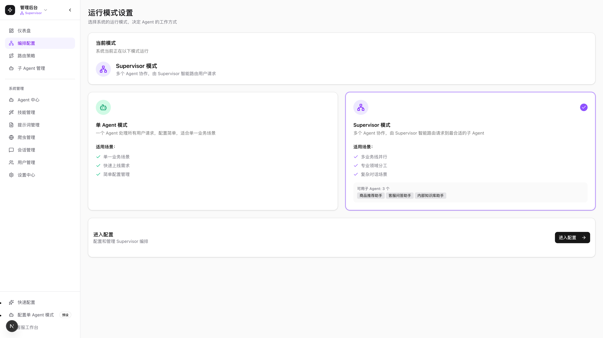 |
| /admin/skills | 技能列表 | 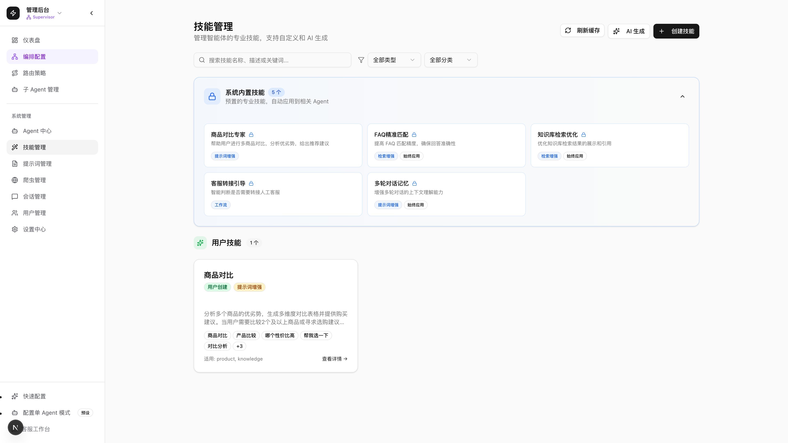 |
| /support | 客服工作台 | 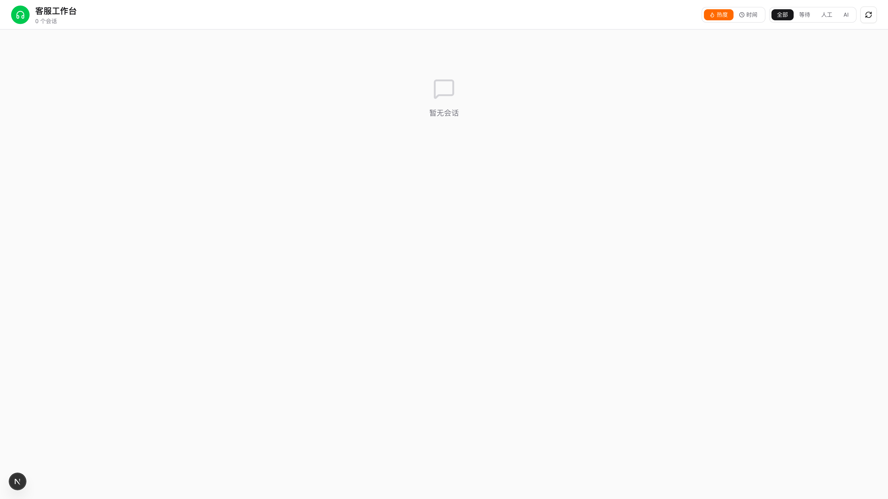 |
