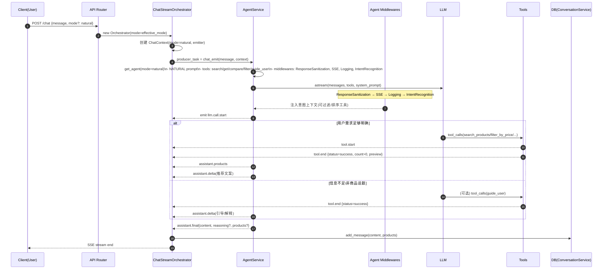
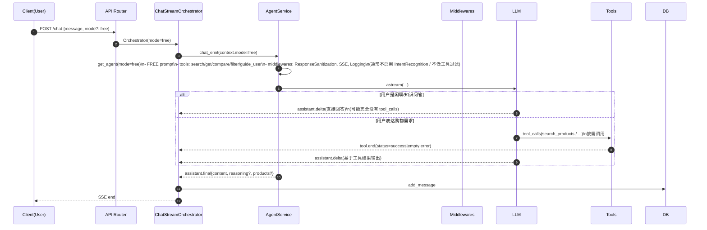
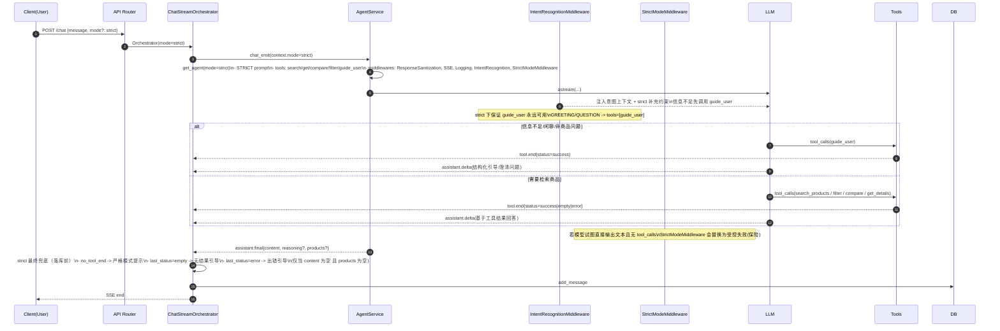

# Chat Modes（natural / free / strict）流程文档（含详细流程图）

本文档描述后端从**请求进入**到**事件流输出**再到**落库**的完整链路，并分别给出 `natural` / `free` / `strict` 三种模式的详细流程图（含中间件差异、工具调用、兜底策略、`tool.end.status` 分支）。

---

## 0. 参与者与关键文件

- **Client**：前端/调用方
- **API Router**：`backend/app/routers/chat.py`
- **ChatStreamOrchestrator**：`backend/app/services/chat_stream.py`
  - 负责：创建 `ChatContext`、消费 domain events、产出 SSE、聚合最终内容并落库、strict 兜底
- **AgentService**：`backend/app/services/agent/agent.py`
  - 负责：按 `mode` 构建 Agent（system prompt + tools + middleware）、执行 `agent.astream(...)` 并把过程转成 domain events
- **Middlewares（Agent Middleware）**
  - `ResponseSanitizationMiddleware`：异常响应清洗
  - `SSEMiddleware`：LLM call start/end 事件
  - `LoggingMiddleware`：日志观测
  - `IntentRecognitionMiddleware`：识别意图并动态调整可用工具（strict 下确保 `guide_user` 可用、不会返回空工具列表）
  - `StrictModeMiddleware`：strict 下若模型“直接回答且无工具调用”则替换为受控失败（保险）
- **Tools**：`backend/app/services/agent/tools/*`
  - `search_products` / `filter_by_price` / `get_product_details` / `compare_products` / `guide_user`
  - 统一 emit `tool.start` / `tool.end`
  - `tool.end.payload.status ∈ {success, empty, error}`

---

## 1. 通用总流程（所有模式共用骨架）

### 1.1 总览流程图（通用骨架）

```mermaid
flowchart TD
  A[Client /chat 请求\nChatRequest: message, conversation_id, user_id, mode?] --> B[API Router\n创建 ChatStreamOrchestrator(mode=effective_mode)]
  B --> C[Orchestrator.run()\n创建 ChatContext(mode, emitter)]
  C --> D[启动 producer_task\nAgentService.chat_emit(...)]
  D --> E[AgentService.get_agent(mode)\n选择 prompt + middlewares + tools]
  E --> F[agent.astream(stream_mode=messages, context=ChatContext)]
  F --> G[AgentService 解析消息流\nAIMessageChunk/AIMessage/ToolMessage]
  G --> H[通过 emitter 发 domain events\nassistant.delta / assistant.reasoning.delta / tool.start / tool.end / assistant.products / assistant.final]
  H --> I[Orchestrator 消费 domain events\n转 SSE + 聚合 full_content/reasoning/products]
  I --> J[producer_task 结束]
  J --> K{strict 兜底检查?}
  K --> L[写入 DB: conversation_service.add_message]
  L --> M[SSE 输出结束]
```

### 1.2 关键数据流

- **mode 传递链路**
  - `ChatRequest.mode`（可选）→ `effective_mode`（请求优先，否则 `settings.CHAT_MODE`）
  - Router → Orchestrator(mode) → ChatContext(mode) → AgentService.get_agent(mode)
  - Middlewares 可从 `request.runtime.context.mode` 读取当前模式

- **事件链路（domain events）**
  - Tool：`tool.start` / `tool.end(status=success|empty|error)`
  - LLM：`llm.call.start` / `llm.call.end`
  - 输出：`assistant.delta` / `assistant.reasoning.delta` / `assistant.products` / `assistant.final`

- **reasoning / content 归一化（保证用户看到正文）**
  - 部分推理模型会把回复放到 `reasoning_content`（additional_kwargs）而 `content` 为空
  - `AgentService.chat_emit` 已兜底：当全程 content 为空时，把 reasoning 提升为最终 content
  - `chat_emit` 也兼容 `AIMessage`（非 chunk）以避免漏掉末尾 `reasoning_content`

---

## 2. Natural 模式：商品推荐优先 + 可适度引导

### 2.1 Natural 行为定义

- 默认模式：适合“正常商品推荐”
- 倾向使用工具找商品、过滤、对比、补详情
- 如用户问非商品问题：允许礼貌引导回商品话题（但不强制失败）

### 2.2 Natural 详细流程图



### 2.3 Natural 常见分支结果

- **成功检索到商品**：`tool.end.status=success` → 正常推荐输出 + `assistant.products`
- **检索无结果**：`tool.end.status=empty` → 模型解释“未找到”，并建议换关键词/预算；也可调用 `guide_user`
- **工具出错**：`tool.end.status=error` → 模型解释失败并建议重试/简化条件

---

## 3. Free 模式：自由聊天优先 + 工具“可用但不强迫”

### 3.1 Free 行为定义

- 目标：用户随便聊也能回答，不强迫回到商品话题
- 工具仍可用：当用户出现购物需求时可自然触发工具
- 通常不启用“强引导/强过滤”的意图识别行为（避免把所有话题拽回商品）

### 3.2 Free 详细流程图



### 3.3 Free 模式兜底原则

- **不强制工具**：没有 `tool.end` 也不算失败
- **不强制引导回商品**：允许自由回答

---

## 4. Strict 模式：必须“有据可依” + 以工具/事件为准 + 分状态引导

### 4.1 Strict 行为定义

Strict 模式有两层约束：

1) **Agent 侧强约束**
- `STRICT system prompt`：强调必须用工具、不能无依据推荐
- `IntentRecognitionMiddleware`：strict 下永远确保 `guide_user` 可用，且不会把工具列表清空
  - 对 `GREETING/QUESTION`：工具收敛为 `[guide_user]`（把“引导”工具化）
- `StrictModeMiddleware`：若模型直接给文本回答且无 tool_calls → 替换为受控失败（保险）

2) **Orchestrator 侧最终兜底**
- 记录 `_saw_tool_end`、`_last_tool_end_status`、`_last_tool_end_name`
- strict 下兜底按 `tool.end.status` 分支
- 兜底触发条件：**仅当最终 content 为空且 products 为空**（避免覆盖正常回答）

### 4.2 Strict 详细流程图



### 4.3 Strict 的 `tool.end.status` 分支引导（Orchestrator 规则）

> 触发前提：`mode == strict` 且 **最终 content 为空** 且 **products 为空**。

- **没有任何 `tool.end`（_saw_tool_end=False）**
  - 输出：`严格模式提示`
  - 语义：没有形成工具闭环（无法保证推荐可靠）

- **最后一次 `tool.end.status == "empty"`**
  - 输出：`严格模式提示（无结果）`
  - 语义：工具调用成功但无结果（商品库没命中）

- **最后一次 `tool.end.status == "error"`**
  - 输出：`严格模式提示（工具出错）`
  - 语义：工具调用异常（建议重试/简化需求/给型号）

---

## 5. 三种模式对比表

| 维度 | natural | free | strict |
|---|---|---|---|
| 目标 | 商品推荐优先 | 自由聊天优先 | 必须有据可依 |
| 工具调用 | 推荐使用 | 按需使用（可不用） | 强制使用（或用 `guide_user`） |
| 意图识别 | 可用（过滤/排序工具） | 通常禁用/弱化 | 必须可用，且确保 `guide_user` 永远可用 |
| 非商品话题 | 引导回商品 | 直接聊 | 用 `guide_user` 引导（工具化） |
| 无结果/出错 | 可解释/引导 | 可解释/引导 | Orchestrator 按 status 输出严格引导（empty/error） |
| “只有思考没 content” | 兜底提升为 content | 兜底提升为 content | 兜底提升为 content + strict 引导策略 |
